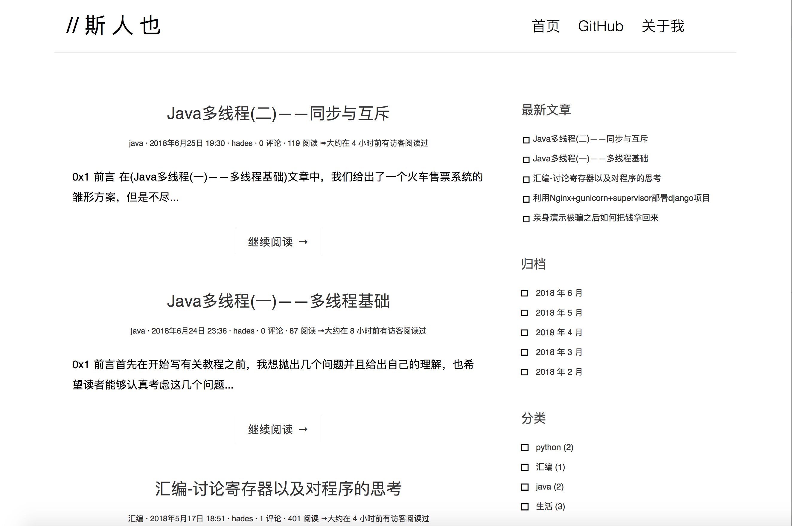
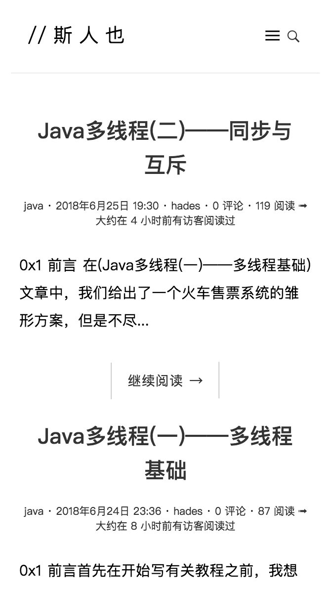

# 斯人也 博客
基于 python3 & django 2.0.2 搭建
[博客传送门](https://www.ihades.cn)

# 功能
- [x] 基础功能(包括网站后台集成管理、文章的增删改查、RSS等)
- [x] 评论系统
- [x]  Markdown优化

# 预览
- PC端
 
- 移动端
 

# 一些小的更新
- [x] 友善的404页面
- [x] 文章历史阅读时间间隔计算

# 注意事项
- 出于网站安全考虑，项目中并没有上传对应的`settting.py`等文件。但其实与`Django`自动生成的标准文件并无太大出入。所以可以在不改动原项目的基础上进行替换。
- 因为本人并非专业前端开发，`CSS`和`JS`等文件并没有很好的整合在一起，往后一定争取时间整合。